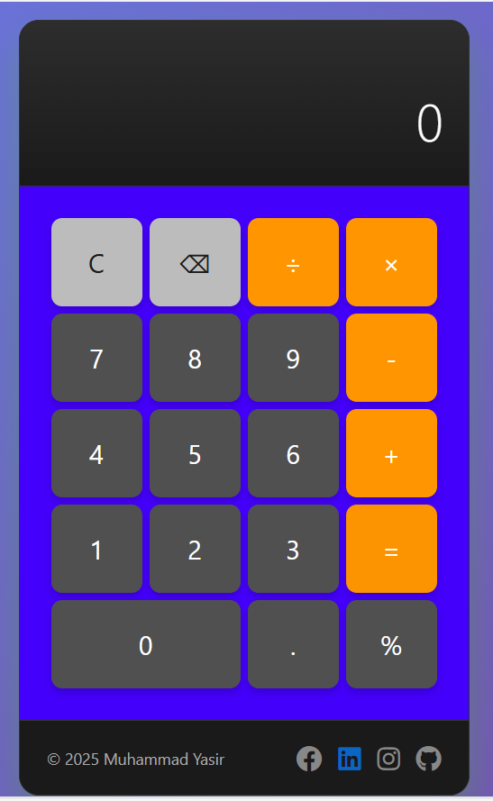

#  Modern Calculator

A sleek, modern, responsive calculator built using **HTML**, **CSS** and **JavaScript** — designed with clean UI, smooth interactions and full keyboard support.

---


---

🔗 **Video Demo:** https://www.linkedin.com/posts/yasirawan4831_frontenddevelopment-html-css-activity-7405710502309490689-ZwsL?utm_source=share&utm_medium=member_desktop&rcm=ACoAAGHhHjwBL8TtLjiiRR4OZsp6cHhpsCQvzoo

---

##  Features

*  **Basic Arithmetic** → Addition, Subtraction, Multiplication, Division
*  **Percentage Calculation**
*  **Modern Dark UI** with gradient theme
*  **Full Keyboard Support**
*  **Responsive Design** for mobile & desktop
*  **Real-time Display Updates**
*  **Error Handling** (Invalid operations prevented)
*  **Visual Button Feedback** on click/press

---

## 📂 File Structure

```
Task01-Calculator/
│
├── index.html        # Main UI structure
├── style.css         # Styles & animations
├── script.js         # Calculator logic + keyboard support
├──assest
└── README.md         # Documentation
```

---

## Usage

### 🖱️ Mouse / Touch

Click the on-screen buttons to perform calculations.

### ⌨ Keyboard Controls

| Key       | Action            |
| --------- | ----------------- |
| 0-9       | Enter numbers     |
| + - * /   | Operators         |
| .         | Decimal point     |
| %         | Percentage        |
| Enter / = | Calculate result  |
| Esc       | Clear all         |
| Backspace | Delete last digit |

---

## 🌐 Social Media

[](https://github.com/yasirawan4831)
[](https://www.linkedin.com/in/yasirawan4831/)
[](https://leetcode.com/u/YasirAwan4831/)
[](https://stackoverflow.com/users/31822196/yasirawan4831)
[](https://www.youtube.com/@YasirTech-t1d)
[](https://developers.google.com/profile/u/yasirawaninfo)
[](https://medium.com/@YasirAwan4831)
[](https://substack.com/@yasirwaninfo)
[](https://www.facebook.com/profile.php?id=61575935942197)
[](https://www.instagram.com/yasirawan4831/)
[](https://x.com/YasirAwan4831)


---

##  Features in Detail

*  Fully responsive layout using CSS Grid & Flexbox
*  Smooth animations using transitions
*  Error handling for invalid inputs & divide-by-zero
*  Clean minimal UI for better readability

---

## 🌍 Browser Support

* Chrome ✔
* Firefox ✔
* Edge ✔
* Safari ✔
* Opera ✔

---

##  License

This project is licensed under the main repository license.
**© 2025 Muhammad Yasir — All Rights Reserved**


---

## 🖼 Output / Screenshots


---

##  Conclusion

A simple yet modern calculator developed as part of the  
**ApexcifyTechnologys Frontend Internship**.

 More tasks coming soon — stay tuned!
