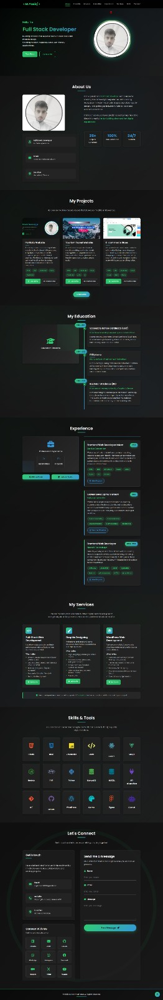
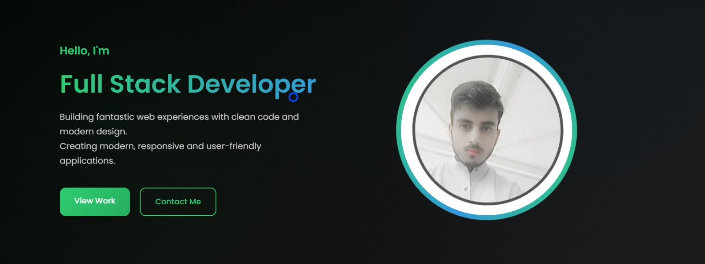

# 🌐 Muhammad Yasir — Web Developer Portfolio

A **modern, responsive and fully functional portfolio website** showcasing my projects, technical skills and professional journey as a **Frontend Web Developer**.


---

##  Live Demo

🔗 **Live Website:**  

https://yasirawan4831.github.io/ApexcifyTechnologys-FrontendInternship/task-2/

 **Deployment Platform:** GitHub Pages  
 **Project Status:** Completed & Live

---
##  Features

###  Modern UI & UX

- Clean and professional user interface
- Dark-themed layout with subtle gradient highlights
- Fully responsive across mobile, tablet and desktop devices
- Smooth transitions, hover effects and micro-animations

###  Website Sections (Navigation Order)

1. **Home (Hero Section)** — landing area with typing text animation
2. **About Me** — personal introduction and professional summary
3. **Projects** — showcased projects with **Load More** functionality
4. **Education** — academic background and qualifications
5. **Experience** — professional experience timeline
6. **Services** — structured 3×3 services grid
7. **Skills** — technical skills with hover-based tooltips
8. **Contact** — contact form with client-side validation

---

## Technical Highlights

### Frontend Stack

* HTML5 (semantic markup)
* CSS3 (custom properties, Grid, Flexbox)
* JavaScript ES6+ (interactivity and dynamic features)


### Tools Used

* Git & GitHub (version control)
* VS Code (development)
* Google Fonts (typography)
* GitHub page (deployment)

---

## Project Structure

```
portfolio-website/
│
├── index.html       # Main HTML structure
├── style.css        # Global styling
├── script.js        # Main JavaScript interactions
│
├── assets/
│   ├── images/      # All image assets
│   ├── project/     # Screenshots for projects
│   └── icons/       # Icon assets
│
├── README.md
├── LICENSE
└── .gitignore
```

---

## Installation & Usage

### 1. Clone the Repository

```
git clone https://github.com/YasirAwan4831/portfolio-website.git
cd portfolio-website
```

### 2. Run Locally

Open `index.html` directly in the browser or run a local server:


```
npx http-server
```

---

---
### ScreenShrt

---


## Key JavaScript Features

### Navigation

* Mobile hamburger menu
* Smooth scrolling
* Active menu highlighting
* Sticky navbar with shadow effect

### Animations

* Typing animation
* Scroll-triggered animations
* Card hover interactions
* Ripple effect on social links

### Dynamic Functionality

* Load More Projects (3 items per batch)
* Skills with hover tooltips
* Contact form validation

### Interactive Components

* Custom cursor
* Scroll-to-top button
* Image hover transitions

---

## Customization Guide

### Personal Details

Update `index.html` to modify:

* Name and title
* About description
* Social links
* Contact information

### Projects

Add project cards in `script.js` under `additionalProjects` array:

```
{
  title: " Muhammad Yaser - Portfolio webSite ",
  description: "A personal portfolio website showcasing my skills, projects and professional experience with a clean and responsive UI.",
  technology: ["HTML", "CSS", "JavaScript"],
  tools: ["Vs code", "Git", "GitHub" "GitHub Page" ],
  liveLink: "https://yasirawan4831.github.io/ApexcifyTechnologys-FrontendInternship/task-2/",
  githubLink: "https://github.com/YasirAwan4831/",
  image: ""
}
```

### Color Theme

In `style.css`, edit:

```
:root {
  --primary-color: #2ecc71;
  --secondary-color: #3498db;
  --text-color: #ffffff;
}
```

---

## Project Highlights

### Featured Projects

* Portfolio Website (this site)
* Tourism Travel Website
* E-commerce Store

### Additional Projects

* To-Do List App
* YARIS AI Chat Bot
* Web Development Quiz App
* Modern Login & Signup Page
* Diploma Final Year Web Project
* WordPress Marketing Agency Site

---

## Known Issues & Fixes

| Issue                   | Solution                  |
| ----------------------- | ------------------------- |
| Images not loading      | Verify file paths         |
| JS not working          | Check console for errors  |
| CSS not applying        | Clear browser cache       |
| Mobile menu not opening | Review related JavaScript |

---

## Future Enhancements

* Backend integration for contact form
* Blog module
* Project comments section
* Dark/Light mode toggle
* Multi-language support
* Category-based project filtering
* Image and performance optimization

---


## Author


**Muhammad Yasir** <br>
GitHub: [https://github.com/YasirAwan4831](https://github.com/YasirAwan4831) <br>
LinkedIn: https://www.linkedin.com/in/yasirawan4831/ <br>
Email: [my3154831409@gmail.com](mailto:my3154831409@gmail.com)

---

## License

This project is licensed under the MIT License.

---

## Acknowledgments

* Font Awesome icons
* Google Fonts
* Open-source contributors
